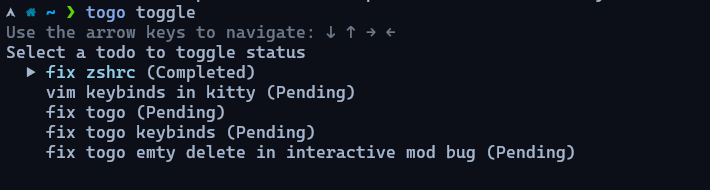

# Togo

<p align="center">
  A command-line todo application built in Go for developers who need to capture ideas without breaking their workflow.
</p>

[](https://github.com/user-attachments/assets/14afdab1-2f6b-419c-9ace-958d8c167646)


## Why Togo Exists

Ever been programming and had a brilliant idea or remembered an important task? You know the struggle - interrupting your flow means losing focus, but ignoring it risks forgetting something important. This is where Togo shines, especially for those of us with ADHD tendencies.

Togo lets you capture those thoughts instantly without breaking your workflow. Your terminal is always just a keystroke away, so just dump your todo with `togo add` and get back to what you were doing. Your brain can relax knowing the idea is safely stored somewhere, and you can maintain your precious focus.

**The core philosophy:** Add it now, manage it later.

## Features

- **Zero-friction capture**: Add ideas directly from your terminal without interrupting your flow
- **Beautiful terminal UI**: Interactive interface for managing todos when you're ready to organize
- **VIM keybinds**: HJKL motions support
- **Multiple management methods**: Use either interactive mode or command-line operations to manage
- **Flexible organization**: Toggle completion, archive finished tasks, delete what's no longer needed
- **Search/filtering**: Find tasks quickly in lists or through partial start-matching
- **Shell integration**: Tab completion for workflow integration

## Usage

### Capturing Ideas (The Main Point!)

When inspiration strikes or a task pops into your head, just:

```bash
togo add should I use "s in my shell std inputs?

togo add "Call the client about project scope"
```
Then get right back to what you were doing. No more mental juggling or lost ideas.

### Managing Your Tasks

Togo offers two primary ways to manage your tasks:

#### 1. Interactive Mode

Open the interactive UI to work with your todos visually:

```bash
togo
# or
togo list           # Active todos only
togo list --all     # All todos
togo list --archived # Archived todos only
```

The interactive mode shows helpful keyboard shortcuts right in the interface.


#### 2. Command-Line Operations

Togo offers flexible command syntax with three usage patterns:

##### a) Direct selection by partial name

```bash
togo toggle meeting
```

If only one task contains "meeting", it executes immediately - no selection needed. If multiple tasks match (e.g., "team meeting" and "client meeting"), Togo automatically opens the selection list so you can choose which one you meant.

##### b) Interactive selection list

```bash
togo toggle
```

Opens a selection list where you can choose from available tasks:



As you type, Togo searches through your tasks and filters the results.

##### c) Shell completion integration

If you've installed shell completion (see below), you can use:

```bash
togo toggle [TAB]
```

Your shell will present available tasks. Type a few letters to filter by name:

```bash
togo toggle me[TAB]
```

Shell will show only tasks containing "me" - perfect for quick selection.


### Available Commands

- `togo add "Task description"` - Add a new task
- `togo toggle [task]` - Toggle completion status
- `togo archive [task]` - Archive a completed task
- `togo unarchive [task]` - Restore an archived task
- `togo delete [task]` - Remove a task permanently
- `togo list [flags]` - View tasks (--all, --archived)

Every command supports `-h` or `--help` flags to display detailed usage information:

```bash
togo toggle --help
togo add -h
```

## Installation

### Option 1: Via Go Install

The simplest way to install Togo:

```bash
go install github.com/ashkansamadiyan/togo@latest
```

Make sure `$GOPATH/bin` is in your PATH to access the installed binary.

### Option 2: Manual Build

```bash
# Clone the repository
git clone https://github.com/ashkansamadiyan/togo.git
cd togo

# Build and install manually
go build
go install     # Installs to $GOPATH/bin
```

### Option 3: Using Make (Recommended)

```bash
# Clone the repository
git clone https://github.com/ashkansamadiyan/togo.git
cd togo

# Install to GOPATH/bin (includes automatic shell completion)
make install

# OR install system-wide (requires sudo)
make install-system
```

All Make installation methods include automatic shell completion setup out of the box, so you can immediately use tab completion for commands and task names.

## Shell Completion

Setting up shell completion makes Togo even more efficient by enabling tab completion for commands and tasks.

### Zsh

```bash
# 1. Create completion directory
mkdir -p ~/.zsh/completion
echo "fpath=(~/.zsh/completion \$fpath)" >> ~/.zshrc

# 2. Enable completions
echo "autoload -Uz compinit && compinit" >> ~/.zshrc

# 3. apply Togo completion
togo completion zsh > ~/.zsh/completion/_togo
source ~/.zshrc
```


### Bash

```bash

# 1. Ensure completion is sourced
echo "[ -r /usr/share/bash-completion/bash_completion ] && . /usr/share/bash-completion/bash_completion" >> ~/.bashrc
source ~/.bashrc

# 2. Install Togo completion
togo completion bash > ~/.bash_completion
source ~/.bash_completion
```


### Fish

```bash
mkdir -p ~/.config/fish/completions
togo completion fish > ~/.config/fish/completions/togo.fish
```

### PowerShell

```powershell
yea, i dont think you PS guys need this tool :)
```

## Data Storage

Togo stores all your data in a simple JSON file at `~/.togo/todos.json`.


## License

This project is licensed under MIT - see the [LICENSE](LICENSE) file for details. 
